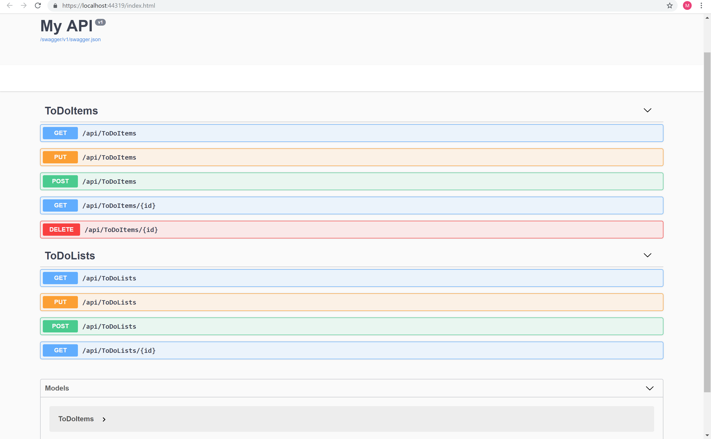

# CODE 19: Web APIs

------------------------------

# Web APIs
#### Lab 19: Create an API
##### *Author: Mike Kelly*

------------------------------

## Description
This C# program is an API which has a To Do database.  It accepts Gets, Pulls, Puts, and Deletes from another website.

------------------------------

## Getting Started
Clone this repository to your local machine.
```
$ git clone [https://github.com/Michael-S-Kelly/ToDo-API.git]
```
#### To run the program from Visual Studio:
Select ```File``` -> ```Open``` -> ```Project/Solution```

Next navigate to the location you cloned the Repository.

Double click on the ```ToDo``` directory.

Then select and open ```ToDo.sln```

------------------------------

## Visuals


##### Application Start



------------------------------

## Change Log


------------------------------
## Collaborators, Contributors, and Other Resources used

### Collaborators


### Contributors


### Other Resources
#### Microsoft Visual C# Step by Step Ninth Edition
#### C# 7.0 in a Nutshell
#### C# Pocket Reference
#### C# and .NET Core Test-Driven Development
#### https://docs.microsoft.com/en-us/aspnet/core/tutorials/getting-started-with-swashbuckle?view=aspnetcore-2.2&tabs=visual-studio

------------------------------
For more information on Markdown: https://www.markdownguide.org/cheat-sheet